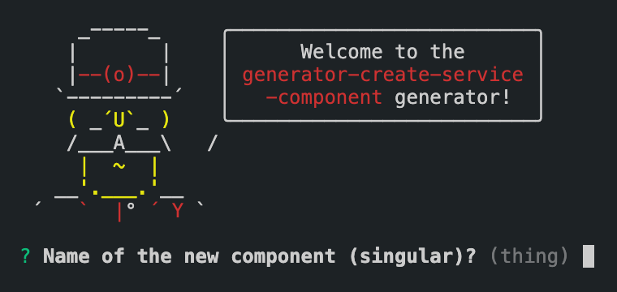

<div align="center">
  <h1>create-service-component</h1>
  <p>Boring Express Microservice Component Generator</p>

  <p>
    <a href="https://github.com/boringcodes/create-service-component/commits" aria-label="Commitizen Friendly">
      
    </a>
    <a href="https://github.com/boringcodes/create-service-component" aria-label="Prettier Code Style">
      
    </a>
    <a href="https://github.com/boringcodes/create-service-component/actions" aria-label="Lint Status">
      
    </a>
    <a href="https://david-dm.org/boringcodes/create-service-component" aria-label="Dependencies Status">
      
    </a>
    <a href="https://www.npmjs.com/package/generator-create-service-component" aria-label="NPM Version">
      
    </a>
    <a href="https://www.npmjs.com/package/generator-create-service-component" aria-label="NPM Downloads">
      
    </a>
    <a href="https://github.com/boringcodes/create-service-component/blob/master/LICENSE" aria-label="MIT License">
      
    </a>
    <a href="https://github.com/boringcodes" aria-label="BoringCodes Verified">
      
    </a>
  </p>

  
</div>

## Features

Generated component includes the following features:

- [x] Generate full CRUD component (list, create, get, update & delete)
- [ ] Auto register the new created component to express routes

## Install

Make sure `yeoman` is installed

```sh
$ yarn global add yo
```

Then install the generator

```sh
$ yarn global add generator-create-service-component
```

## Usage

Navigate to the created service (using [@boringcodes/create-service](https://github.com/boringcodes/create-service)) root dir and run the following command to generate new component

```sh
$ yo create-service-component

# or :with-mongo
$ yo create-service-component:with-mongo

# or :with-postgres-sequelize
$ yo create-service-component:with-postgres-sequelize

# or :with-postgres-typeorm
$ yo create-service-component:with-postgres-typeorm

# or :with-postgres-prisma
$ yo create-service-component:with-postgres-prisma
```

This scaffolds out:

```
├── src
│   ├── components
│   │   ├── component-names
│   │   │   ├── constants.ts
│   │   │   ├── controller.ts
│   │   │   ├── index.ts
│   │   │   ├── model.ts        (:with-mongo/:with-postgres-sequelize/:with-postgres-typeorm)
│   │   │   ├── repository.ts   (:with-mongo/:with-postgres-sequelize/:with-postgres-typeorm/:with-postgres-prisma)
│   │   │   ├── types.ts
│   │   └── ...
│   ├── ...
├── ...
```

## Contributing

Pull requests are welcome. For major changes, please open an issue first to discuss what you would like to change.

Please make sure to update tests as appropriate.

## Authors

[BoringCodes](https://github.com/boringcodes)

## License

[MIT](https://github.com/boringcodes/create-service-component/blob/master/LICENSE)
